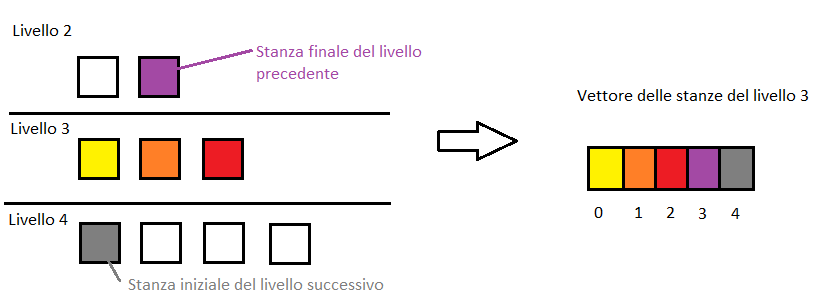
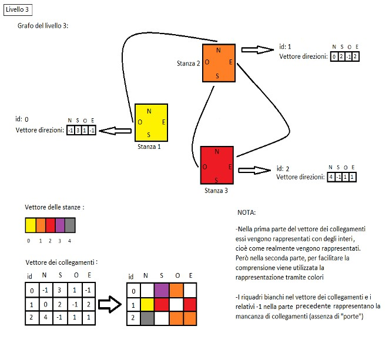
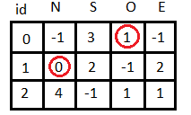
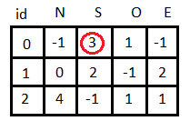
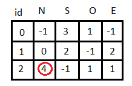
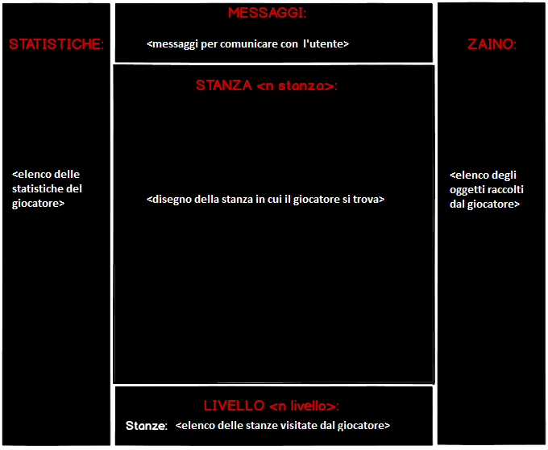

# @t - m@n

### Implementazione modello dei dati:
Il Livello del nostro gioco è definito nel seguente modo:
Il numero delle stanze di ogni livello corrisponde al numero del livello nel quale ci si trova, cioè ad
ogni livello viene incrementato di uno il numero delle stanze. (es: livello 25 avrà 25 stanze)
Nel vettore delle stanze gli elementi sono puntatori alle stanze. Tale vettore ha dimensione
numero delle stanze + 2, poiché nei due indici rimanenti verranno mantenuti i riferimenti al livello
successivo e a quello precedente poiché durante l'esecuzione del gioco e possibile spostarsi
attraverso i livelli. In altre parole il vettore stanze conterrà: i puntatori alle stanze del livello nella
porzione del vettore che va da indice 0 a indice n-1 (dove n e il numero di stanze del livello), il
puntatore della stanza finale del livello precedente in indice n, infine il puntatore alla stanza iniziale
del livello successivo in indice n+1.

Esempio: I colori rappresentano i puntatori alle stanze interessate

Inoltre vi è un vettore che tiene conto dei collegamenti tra le stanze (vettore di puntatori a
Collegamento).
La classe Collegamento descrive a quali altre stanze si può passare una volta giunti nella stanza a
cui si riferisce il collegamento, esso è descritto nel seguente modo:
Indice (id) della stanza del vettore delle stanze della classe livello alla quale il collegamento si
riferisce.
Le stanze possono avere una "porta" su ogni lato del quadrato che le rappresenta, per questo motivo
la dimensione del vettore delle direzioni è 4. Gli indici del vettore indicano rispettivamente i 4 punti
cardinali: Nord (indice 0), Sud (indice 1), Ovest (indice 2), Est (indice 3).
Tale vettore contiene dei dati interi i quali si riferiscono agli indici del vettore delle stanze della
classe livello.

Esempio: Livello 3

A questo punto possiamo esporre i criteri secondo i quali vengono scelti tali collegamenti:
- Ogni arco del grafo (nell'immagine viene rappresentato come una linea da una stanza ad un'altra)
che collega la stanza A alla stanza B consente di passare sia da A → B che da B→ A. Cioè tale arco
può essere percorso sia partendo da A per andare verso B che in senso contrario.
Infatti, prendiamo in considerazione l'arco del grafo che collega la stanza 1 (id:0) alla stanza 2 (id:1)
nella tabella delle adiacenze vi è 

	
	
- Il campo sud della stanza iniziale del livello è sempre collegata alla stanza finale del livello
precedente, quindi la porta a sud della stanza iniziale esiste sempre.
Infatti, nella tabella delle adiacenze vi è:

	
	
- Il campo nord della stanza finale del livello è sempre collegata alla stanza iniziale del livello
successivo, quindi la porta a nord della stanza finale esiste sempre.
Infatti, nella tabella delle adiacenze vi è:

In questo modo il giocatore sa sempre che per andare al livello precedente o al livello successivo
esso si deve trovare rispettivamente nella stanza iniziale e andare verso sud o nella stanza finale e
andare verso nord.
La Stanza è rappresentata da una matrice nella quale si tiene conto della posizione dei vari
personaggi e della posizione dei muri, la parte principale di tale classe è quella relativa al
riempimento randomico di tale matrice.
Quando viene popolato il livello, vengono create e riempite le stanze di tale livello. Queste sono
stanze quadrate che possono contenere muri, mostri, bauli, venditori e porte. Come prima cosa
durante il riempimento, viene settata randomicamente la dimensione della stanza, che rientra in un
range già stabilito, successivamente si procede con il posizionamento degli oggetti e dei personaggi.
Anche gli oggetti sono casualmente disposti, infatti ognuno di essi ha una sua caratteristica funzione
di probabilità, che in base ad alcuni parametri (ad esempio il livello corrente o la dimensione della
stanza) stabilisce con quanta facilità esso si potrà trovare trovare in una posizione della stanza.
Inoltre bisogna tenere conto di alcuni accorgimenti, in primo luogo bisogna che in ogni stanza tutte
le porte siano raggiungibili dal giocatore. Quindi viene creata una strada (sempre casuale) che riesca
a collegare tutte le porte della stanza, nella quale muri e venditori non possono essere messi,
evitando così di bloccare il percorso del giocatore. Una volta riempita la stanza questa via non sarà
riconoscibile all'utente, ma gli permetterà di proseguire il gioco raggiungendo (ipoteticamente)
qualunque stanza lui desideri.
Bisogna anche evitare che si creino linee chiuse di muri, questo perché all'interno potrebbero
apparire oggetti o personaggi che il giocatore non riuscirebbe mai a raggiungere. Per fare ciò
vengono contrassegnate le caselle che il giocatore può raggiungere nella stanza, e tutte le altre, che
saranno appunto le caselle interne ai muri, verranno trasformate in muri.
L'idea usata per generare i muri è semplicemente quella di partire dalla posizione di uno spot della
matrice (del tipo <x,y>), e manipolarlo in modo tale da ottenere un rumore che oscilla tra 0 e 2. Nel
caso il rumore venga maggiore o uguale a 1.2 per una particolare casella, quella verrà candidata ad
essere muro. Successivamente tutte le caselle irraggiungibili verranno trasformate in muri.
La classe GeneratoreLivelli si occupa di generare randomicamente il livello nel quale il giocatore
passa, la parte principale di tale classe è quella relativa alla scelta randomica dei collegamenti tra le
stanze del livello.
Infine GestoreLivelli gestisce i livelli del gioco mediante una lista di livelli.

### Spiegazione regole del gioco:
Il gioco consiste nell'esplorazione di vari livelli, composti da un numero crescente di stanze, che
possono contenere nemici, muri, forzieri e venditori. La forza dei nemici, e di conseguenza la
difficoltà del gioco, cresce in proporzione al livello in cui ci si trova.
I parametri del giocatore, così come quelli dei nemici, sono espressi sotto forma di quattro
statistiche (forza, destrezza,costituzione, fortuna) e influenzano vari aspetti del gioco; forza e
destrezza vengono utilizzate nel calcolo dei danni e nell'interazione con le armi, la costituzione
aumenta i punti vita del personaggio e la fortuna aumenta l'oro e l'esperienza ricevuti, così come i
danni inflitti e la possibilità che un nemico lasci cadere l'arma che sta utilizzando quando vienesconfitto.
Ad ogni turno il giocatore ha a disposizione 5 punti azione, da spendere muovendosi, attaccando,
aprendo forzieri o bevendo pozioni; allo stesso modo anche i nemici hanno altrettanti punti azione,
ma si limitano a muoversi o attaccare. Esistono anche azioni di gioco che non consumano questi
punti, come il cambiare o scartare un'arma, l'aprire una porta e il comprare o vendere oggetti a un
venditore.
Il metodo di attacco è il medesimo sia per il giocatore che per i nemici, così come il calcolo dei
danni e le tipologie di armi disponibili; queste hanno parametri diversi a seconda del tipo (ne
esistono tre), di un fattore casuale e del livello, per allinearsi con l'incremento di difficoltà man
mano che il gioco procede; i parametri delle armi sono il danno minimo, il danno massimo, le
statistiche minime richieste per utilizzarle, i moltiplicatori di danno relativi a forza e destrezza e il
prezzo.
Similmente alle armi anche i nemici possono essere di tre tipi diversi, ai quali corrispondono diversi
intervalli di statistiche, le quali sono generate casualmente e quindi con la possibilità di essere
differenti per ogni nemico presente nel livello, anche nel caso di nemici dello stesso tipo; sulla
mappa i nemici sono rappresentati con una lettera diversa a seconda del tipo; una volta sconfitto un
nemico dà al giocatore una certa quantità di oro ed esperienza, e viene rimosso dal gioco anche sulla
matrice sottostante (venendo sostituito dal valore corrispondente a uno spazio vuoto).
I venditori sono una classe a parte e possiedono solo un inventario composto di un numero
prefissato di armi, che il giocatore può comprare in cambio di oro; viceversa anche il venditore può
comprare armi dal giocatore. I forzieri generano un'arma casuale nel momento in cui vengono aperti
(ovvero nel momento in cui il giocatore non ha l'inventario pieno e utilizza il comando per aprirli) e
poi scompaiono.
Il giocatore ha inoltre la possibilità di avanzare di livello una volta accumulata una certa quantità di
esperienza (ottenuta sconfiggendo nemici), e conseguentemente migliorare una delle sue statistiche.
Nel corso del turno è possibile compiere anche azioni che non modificano la situazione di gioco
attuale, come il visualizzare una schermata di istruzioni, impostare un nemico adiacente come
nuovo nemico selezionato o ottenere informazioni più dettagliate su quest'ultimo.
È inoltre presente la possibilità di saltare il turno, a condizione di aver compiuto almeno un'azione
all'interno di esso.
Il gioco termina con la sconfitta del giocatore, ovvero quando i suoi punti vita scendono a 0, o con
la sua vittoria, che può essere conseguita raggiungendo un certo livello di esperienza o una certa
quantità di oro (rispettivamente 100 e 100.000, segnati come `LEV_VICTORY` e `GOLD_VICTORY`
nel codice).

### Implementazione turni:
Il gioco, nel suo livello più esterno, consiste in un solo oggetto, che si occupa della gestione dei
turni. Alla creazione dell'oggetto vengono inizializzati al suo interno anche tutti gli oggetti
/accessori di cui il gioco ha bisogno per funzionare: il controller (che si preoccupa di gestire l'input
e chiamare i metodi per disegnare il gioco), il giocatore, e il gestore dei livelli (che crea i vari livelli
e gestisce il passaggio dall'uno all'altro). Successivamente a questo viene chiamato il metodo play(),
che è il ciclo principale del gioco. Fino a che si verificano le condizioni che servono per proseguire
il gioco (ovvero il giocatore non è stato né sconfitto, né ha vinto) si alternano la sequenza di metodi
necessaria a far giocare il giocatore o il mostro. Si passa dal turno del giocatore a quello del mostro
nel momento in cui il primo ha esaurito i suoi punti azione (cosa che viene controllata all'inizio di
ogni iterazione del ciclo principale). Simmetricamente, succede altrettanto nel turno del mostro.

### Movimento dei mostri:
Quando il turno passa ai mostri, ognuno di questi compie esattamente le stesse azioni. Per prima
cosa viene creata internamente al mostro una rappresentazione della matrice della stanza, che in
ogni casella ha un numero che simboleggia il numero di passi necessari per raggiungere il giocatore
da quella casella. Possono verificarsi poi tre situazioni distinte:
1. Il giocatore si trova nel range entro il quale il mostro ecide di inseguirlo (trovando la strada verso
di lui seguendo la mappa che rappresenta la stanza);
2. Il mostro si trova davanti al giocatore stesso (nel qual caso lo attacca direttamente);
3. Il mostro si trova lontano dal giocatore. In questo caso, si muove a caso in una delle quattro
direzioni concesse;

### Grafica:
Per la realizzazione grafica del gioco abbiamo utilizzato la libreria ncurses, la quale permette di
creare finestre modificabili in modo indipendente dall'intera grafica. L'oggetto che si occupa della
grafica è il Drawer.

Il Controller è l'oggetto che fa da intermediario tra il Drawer (l'oggetto che si preoccupa della
grafica) e le strutture dati che determinano la dinamica del gioco. Inoltre il controller è l'oggetto che
gestisce l'input, quindi colui che riceve direttamente le istruzioni dall'utente. Il suo funzionamento è
il seguente: si mette in ascolto e appena l'utente compie un'azione (preme un tasto) lui la riconosce,
la interpreta, effettua i necessari cambiamenti agli oggetti con i quali interagisce e poi comanda al
drawer di rappresentare la modifica appena compiuta.
Esempio: Se l'utente preme 'K', il controller riconosce che è il comando per l'attacco, quindi prima
controlla se l'utente ha selezionato un mostro vicino e se ha abbastanza punti azione, poi riduce l'hp
del mostro e i punti azione del giocatore, poi dice al Drawer di rappresentare graficamente
